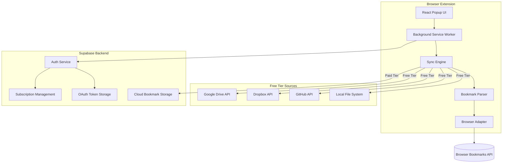
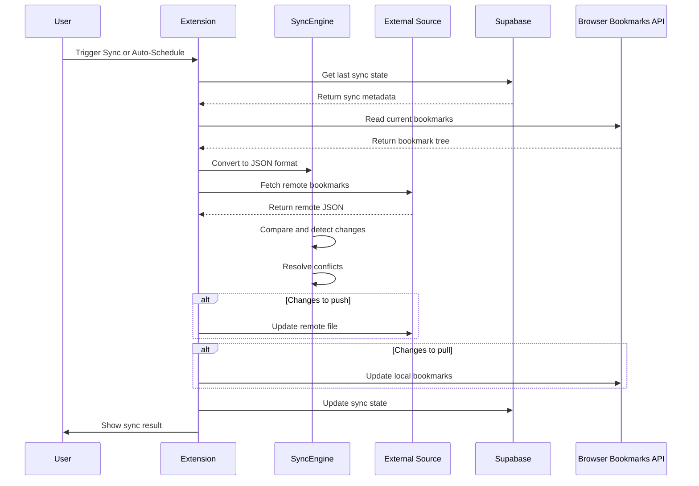
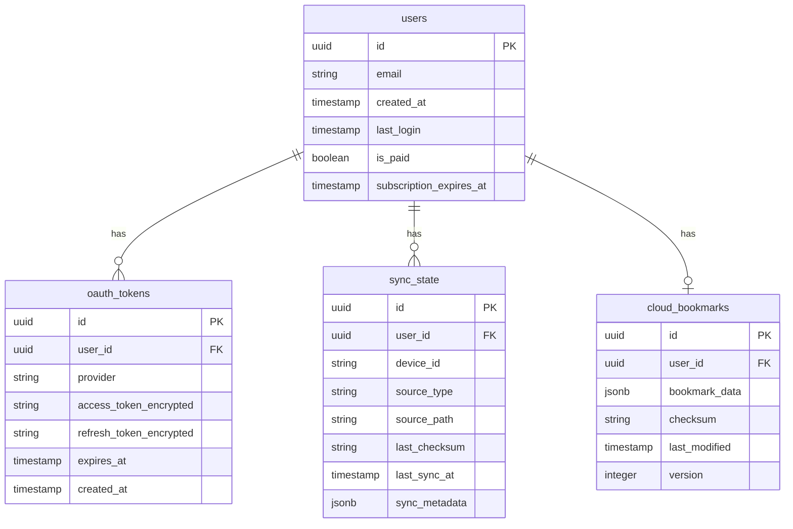
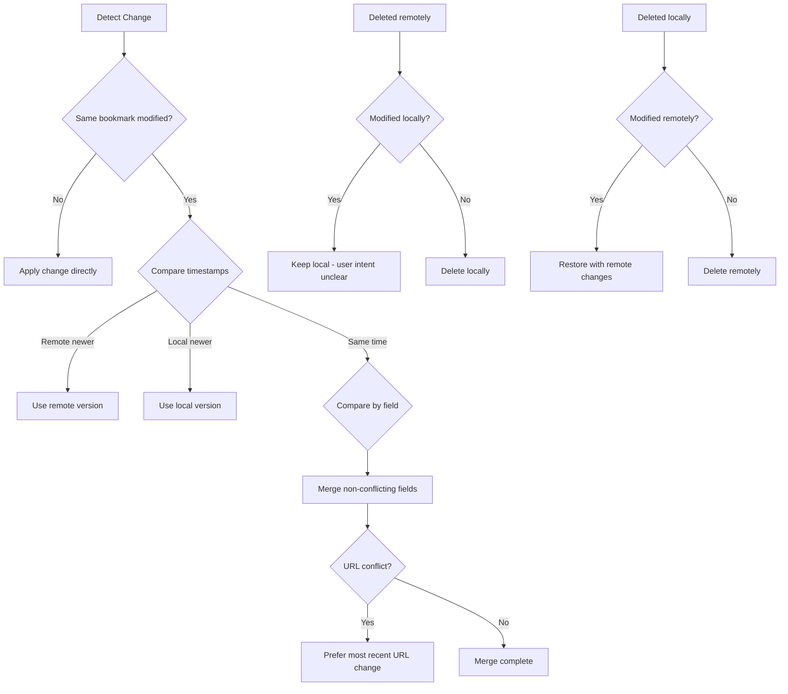
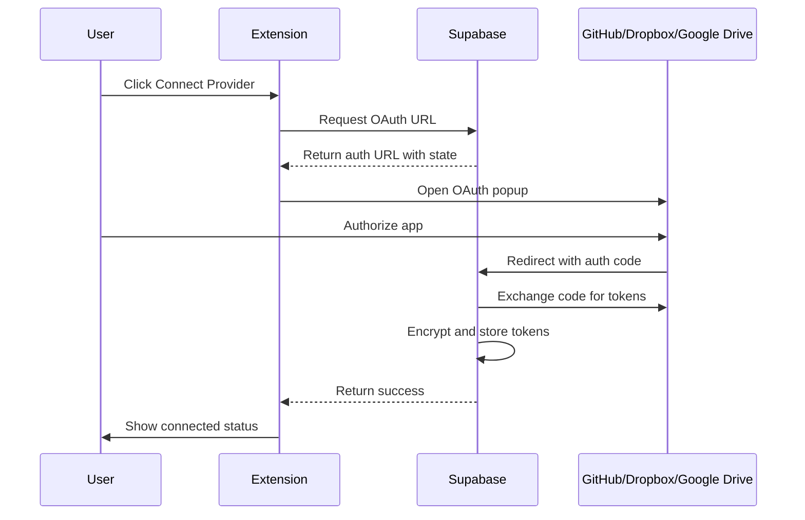
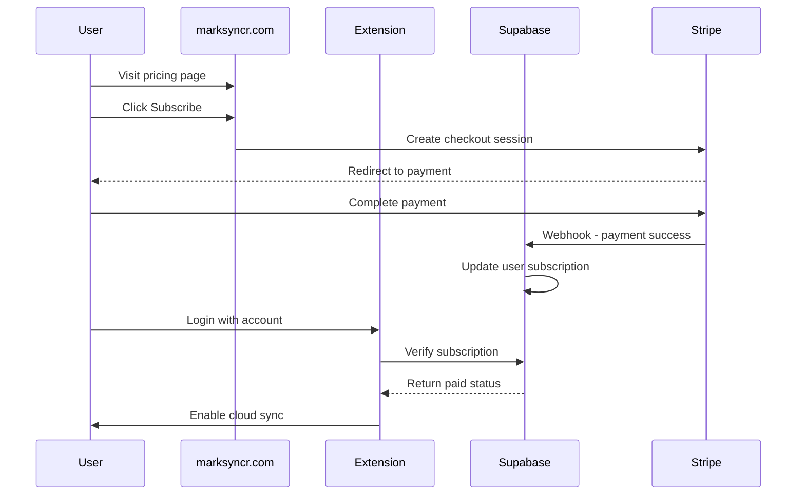

# MarkSyncr - Bookmark Sync Extension Architecture

## Overview

MarkSyncr is a cross-browser extension that enables two-way bookmark synchronization between browsers and external storage sources. Built with React and Tailwind CSS, with Supabase backend for paid tier cloud storage and user management.

## Business Model

### Free Tier - BYOS (Bring Your Own Storage)

- Local file sync
- GitHub sync (OAuth)
- Dropbox sync (OAuth)
- Google Drive sync (OAuth)
- User manages their own storage
- No account required

### Paid Tier - Managed Cloud

- Supabase Cloud storage (we host bookmarks)
- Simple email/password or social login
- Cross-device sync built-in
- No OAuth complexity for users
- Premium support

## Requirements Summary

- **Browsers**: Chrome and Firefox (Safari deferred)
- **Sync Direction**: Two-way bidirectional sync
- **Data Format**: Custom JSON format preserving toolbar/menu/other bookmark locations
- **Free Sources**: Local file, GitHub, Dropbox, Google Drive (all OAuth)
- **Paid Source**: Supabase Cloud (direct storage)
- **Sync Triggers**: Automatic on schedule + manual trigger option
- **Backend**: Supabase for paid user auth, cloud storage, and OAuth token management

---

## System Architecture



---

## Data Flow - Sync Process



---

## JSON Bookmark Schema

```json
{
  "version": "1.0",
  "schemaVersion": 1,
  "metadata": {
    "lastModified": "2025-12-21T05:41:00.000Z",
    "lastSyncedBy": "device-uuid",
    "checksum": "sha256-hash"
  },
  "bookmarks": {
    "toolbar": {
      "id": "toolbar_root",
      "title": "Bookmarks Toolbar",
      "children": [
        {
          "id": "unique-id-1",
          "type": "bookmark",
          "title": "Example Site",
          "url": "https://example.com",
          "dateAdded": "2025-01-01T00:00:00.000Z",
          "dateModified": "2025-12-01T00:00:00.000Z"
        },
        {
          "id": "unique-id-2",
          "type": "folder",
          "title": "Work",
          "children": []
        }
      ]
    },
    "menu": {
      "id": "menu_root",
      "title": "Bookmarks Menu",
      "children": []
    },
    "other": {
      "id": "other_root",
      "title": "Other Bookmarks",
      "children": []
    }
  }
}
```

---

## Supabase Database Schema



---

## Project Structure - Monorepo

```
marksyncr/
├── apps/
│   ├── web/                          # marksyncr.com web app
│   │   ├── src/
│   │   │   ├── app/                  # Next.js app router
│   │   │   │   ├── page.tsx          # Landing page
│   │   │   │   ├── dashboard/        # User dashboard
│   │   │   │   ├── pricing/          # Pricing page
│   │   │   │   ├── auth/             # Auth pages
│   │   │   │   └── api/              # API routes
│   │   │   ├── components/           # Web-specific components
│   │   │   └── styles/
│   │   ├── public/
│   │   ├── next.config.js
│   │   ├── tailwind.config.js
│   │   └── package.json
│   │
│   └── extension/                    # Browser extension
│       ├── src/
│       │   ├── background/
│       │   │   ├── index.ts          # Service worker entry
│       │   │   ├── sync-scheduler.ts # Auto-sync scheduling
│       │   │   └── message-handler.ts
│       │   ├── popup/
│       │   │   ├── App.tsx           # Main popup component
│       │   │   ├── index.tsx         # Popup entry point
│       │   │   └── components/
│       │   │       ├── SourceSelector.tsx
│       │   │       ├── SyncStatus.tsx
│       │   │       ├── Settings.tsx
│       │   │       └── AuthButton.tsx
│       │   └── adapters/
│       │       ├── browser-adapter.ts
│       │       ├── chrome-adapter.ts
│       │       └── firefox-adapter.ts
│       ├── public/
│       │   ├── manifest.chrome.json
│       │   ├── manifest.firefox.json
│       │   ├── icons/
│       │   └── popup.html
│       ├── vite.config.ts
│       └── package.json
│
├── packages/
│   ├── core/                         # Shared sync logic
│   │   ├── src/
│   │   │   ├── bookmark-parser.ts
│   │   │   ├── bookmark-serializer.ts
│   │   │   ├── sync-engine.ts
│   │   │   ├── conflict-resolver.ts
│   │   │   └── diff-engine.ts
│   │   ├── package.json
│   │   └── tsconfig.json
│   │
│   ├── sources/                      # Storage source integrations
│   │   ├── src/
│   │   │   ├── base-source.ts
│   │   │   ├── local-file.ts
│   │   │   ├── github.ts
│   │   │   ├── dropbox.ts
│   │   │   ├── google-drive.ts
│   │   │   └── supabase-cloud.ts
│   │   ├── package.json
│   │   └── tsconfig.json
│   │
│   ├── types/                        # Shared TypeScript types
│   │   ├── src/
│   │   │   ├── bookmark.ts
│   │   │   ├── sync.ts
│   │   │   ├── source.ts
│   │   │   └── user.ts
│   │   ├── package.json
│   │   └── tsconfig.json
│   │
│   └── ui/                           # Shared UI components
│       ├── src/
│       │   ├── Button.tsx
│       │   ├── Card.tsx
│       │   ├── Input.tsx
│       │   └── index.ts
│       ├── package.json
│       └── tsconfig.json
│
├── supabase/
│   ├── migrations/
│   │   ├── 001_initial_schema.sql
│   │   └── 002_cloud_bookmarks.sql
│   ├── functions/
│   │   ├── oauth-callback/
│   │   └── stripe-webhook/
│   └── config.toml
│
├── tests/
│   ├── core/
│   │   ├── sync-engine.test.ts
│   │   ├── bookmark-parser.test.ts
│   │   └── conflict-resolver.test.ts
│   └── e2e/
│       └── extension.test.ts
│
├── package.json                      # Root package.json
├── pnpm-workspace.yaml               # pnpm workspace config
├── turbo.json                        # Turborepo config
├── tsconfig.base.json                # Shared TS config
└── README.md
```

---

## Conflict Resolution Strategy



---

## Browser Adapter Pattern

The extension uses an adapter pattern to handle differences between Chrome and Firefox bookmark APIs:

| Feature           | Chrome   | Firefox                                  |
| ----------------- | -------- | ---------------------------------------- |
| Manifest Version  | V3       | V2 or V3                                 |
| Service Worker    | Required | Optional                                 |
| Bookmark Root IDs | 0, 1, 2  | toolbar**\_**, menu**\_**, unfiled**\_** |
| Promises          | Native   | webextension-polyfill                    |

---

## OAuth Flow - Free Tier



---

## Paid Tier Flow



---

## Key Technical Decisions

### 1. Build Tool: Vite

- Fast HMR for development
- Excellent TypeScript support
- Easy to configure for extension builds

### 2. State Management: Zustand

- Lightweight
- Works well with React
- Easy persistence to extension storage

### 3. Supabase Edge Functions

- Handle OAuth token exchange securely
- Keep client secrets server-side
- Provide webhook endpoints if needed

### 4. Bookmark ID Mapping

- Browser bookmark IDs are not portable
- Use content-based hashing for stable IDs
- Map browser IDs to stable IDs during sync

---

## Security Considerations

1. **OAuth Tokens**: Stored encrypted in Supabase, never in extension storage
2. **Local File Access**: Uses File System Access API with user permission
3. **Cross-Origin**: All API calls go through background service worker
4. **Supabase RLS**: Row-level security ensures users only access their own data

---

## Future Considerations (Safari)

Safari Web Extensions require:

- Xcode project wrapper
- Different manifest format
- App Store distribution
- Native app container

Recommend deferring Safari until Chrome/Firefox are stable.
