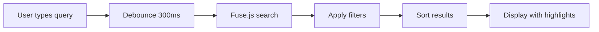
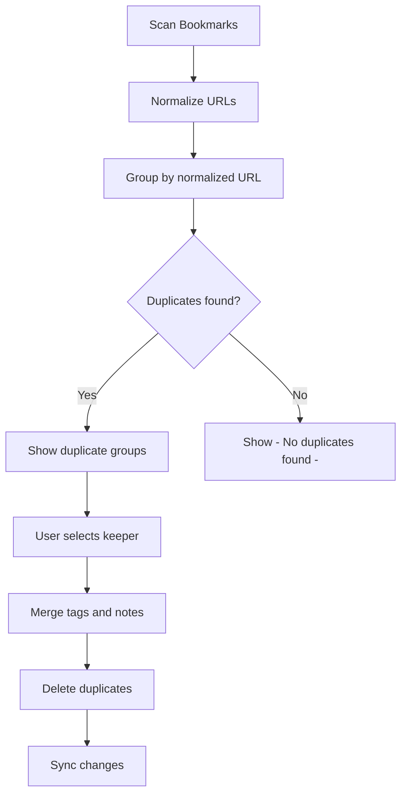

# MarkSyncr Pro Features Implementation Plan

## Overview

This plan outlines the implementation of new Pro features to increase the value proposition of the $5/mo subscription tier.

## Selected Features

### High-Value Features

1. **Smart Bookmark Search** - Full-text search with filters
2. **Duplicate Detection & Cleanup** - Find and merge duplicates
3. **Broken Link Checker** - Scan for dead links
4. **Bookmark Analytics** - Usage statistics dashboard
5. **Import from Anywhere** - Support multiple import formats
6. **Export Options** - Multiple export formats

### Productivity Features

1. **Bookmark Tags** - Custom tags beyond folders
2. **Bookmark Notes** - Personal notes/descriptions
3. **Scheduled Sync** - Custom sync intervals for Pro users

---

## Architecture Changes

### Database Schema Updates

```sql
-- New columns for bookmarks (in bookmark_data JSONB)
-- Each bookmark can now have:
-- - tags: string[]
-- - notes: string
-- - lastChecked: timestamp (for broken link checker)
-- - linkStatus: 'valid' | 'broken' | 'redirect' | 'unknown'
-- - visitCount: number (from analytics)
-- - lastVisited: timestamp

-- New table for user tags
CREATE TABLE public.user_tags (
    id UUID PRIMARY KEY DEFAULT gen_random_uuid(),
    user_id UUID NOT NULL REFERENCES public.users(id) ON DELETE CASCADE,
    name TEXT NOT NULL,
    color TEXT DEFAULT '#3B82F6',
    created_at TIMESTAMPTZ NOT NULL DEFAULT NOW(),
    UNIQUE(user_id, name)
);

-- New table for bookmark analytics
CREATE TABLE public.bookmark_analytics (
    id UUID PRIMARY KEY DEFAULT gen_random_uuid(),
    user_id UUID NOT NULL REFERENCES public.users(id) ON DELETE CASCADE,
    bookmark_id TEXT NOT NULL,
    url TEXT NOT NULL,
    visit_count INTEGER DEFAULT 0,
    last_visited_at TIMESTAMPTZ,
    created_at TIMESTAMPTZ NOT NULL DEFAULT NOW(),
    updated_at TIMESTAMPTZ NOT NULL DEFAULT NOW(),
    UNIQUE(user_id, bookmark_id)
);

-- New table for link check results
CREATE TABLE public.link_checks (
    id UUID PRIMARY KEY DEFAULT gen_random_uuid(),
    user_id UUID NOT NULL REFERENCES public.users(id) ON DELETE CASCADE,
    bookmark_id TEXT NOT NULL,
    url TEXT NOT NULL,
    status TEXT CHECK (status IN ('valid', 'broken', 'redirect', 'timeout', 'unknown')),
    status_code INTEGER,
    redirect_url TEXT,
    checked_at TIMESTAMPTZ NOT NULL DEFAULT NOW(),
    UNIQUE(user_id, bookmark_id)
);

-- New table for sync schedules (Pro feature)
CREATE TABLE public.sync_schedules (
    id UUID PRIMARY KEY DEFAULT gen_random_uuid(),
    user_id UUID NOT NULL REFERENCES public.users(id) ON DELETE CASCADE,
    interval_minutes INTEGER NOT NULL DEFAULT 60,
    enabled BOOLEAN DEFAULT TRUE,
    last_scheduled_sync TIMESTAMPTZ,
    next_scheduled_sync TIMESTAMPTZ,
    created_at TIMESTAMPTZ NOT NULL DEFAULT NOW(),
    updated_at TIMESTAMPTZ NOT NULL DEFAULT NOW(),
    UNIQUE(user_id)
);
```

### Updated Bookmark JSON Schema

```json
{
  "version": "1.1",
  "schemaVersion": 2,
  "metadata": {
    "lastModified": "2025-12-21T05:41:00.000Z",
    "lastSyncedBy": "device-uuid",
    "checksum": "sha256-hash"
  },
  "bookmarks": {
    "toolbar": {
      "id": "toolbar_root",
      "title": "Bookmarks Toolbar",
      "children": [
        {
          "id": "unique-id-1",
          "type": "bookmark",
          "title": "Example Site",
          "url": "https://example.com",
          "dateAdded": "2025-01-01T00:00:00.000Z",
          "dateModified": "2025-12-01T00:00:00.000Z",
          "tags": ["work", "reference"],
          "notes": "Great resource for API documentation",
          "linkStatus": "valid",
          "lastChecked": "2025-12-20T00:00:00.000Z"
        }
      ]
    }
  },
  "tags": [
    { "name": "work", "color": "#3B82F6" },
    { "name": "reference", "color": "#10B981" }
  ]
}
```

---

## Feature Implementation Details

### 1. Smart Bookmark Search

**Location**: Extension popup + Web dashboard

**Capabilities**:

- Full-text search across title, URL, notes, and tags
- Filter by: folder, tag, date range, domain
- Sort by: relevance, date added, alphabetical
- Highlight matching terms

**Implementation**:

- Client-side search using Fuse.js for fuzzy matching
- Index bookmarks on sync for fast search
- Search UI in extension popup with expandable filters



### 2. Duplicate Detection & Cleanup

**Location**: Extension popup + Web dashboard

**Detection Criteria**:

- Exact URL match
- Normalized URL match (ignore trailing slash, www, http vs https)
- Similar title + same domain

**UI Flow**:

1. User clicks Scan for Duplicates
2. Show progress indicator
3. Display grouped duplicates
4. User selects which to keep
5. Merge/delete others



### 3. Broken Link Checker

**Location**: Web dashboard (background job) + Extension

**Implementation**:

- Supabase Edge Function to check links
- Rate-limited to avoid abuse
- Check via HEAD request first, fallback to GET
- Store results in link_checks table
- Pro users: check all links monthly
- Show broken links in dashboard with one-click delete

**Status Types**:

- `valid` - 200 OK
- `redirect` - 301/302 (show new URL)
- `broken` - 404, 410, or connection error
- `timeout` - Request timed out
- `unknown` - Not yet checked

### 4. Bookmark Analytics

**Location**: Web dashboard

**Metrics**:

- Total bookmarks count
- Bookmarks by folder (pie chart)
- Bookmarks by tag (bar chart)
- Recently added (timeline)
- Never visited bookmarks
- Most visited bookmarks
- Bookmarks added per week/month (trend)
- Domain distribution (top 10 domains)

**Implementation**:

- Track visits via extension (optional, privacy-respecting)
- Aggregate data in Supabase
- Display with Chart.js or Recharts

### 5. Import from Anywhere

**Supported Formats**:

- Browser HTML export (Chrome, Firefox, Safari)
- Pocket export (HTML)
- Raindrop.io export (HTML, CSV)
- Pinboard export (JSON)
- Generic JSON
- CSV with URL, Title, Tags columns

**Implementation**:

- File upload in web dashboard
- Parser for each format in packages/core
- Preview before import
- Merge strategy: skip duplicates, overwrite, or create new

### 6. Export Options

**Formats**:

- HTML (browser-compatible)
- JSON (MarkSyncr format)
- CSV (spreadsheet-friendly)
- Markdown (documentation-friendly)

**Options**:

- Export all or selected folders
- Include/exclude tags and notes
- Flatten or preserve hierarchy

### 7. Bookmark Tags

**Implementation**:

- Tags stored in bookmark_data JSONB
- Tag management UI in extension and web
- Auto-suggest existing tags
- Color-coded tags
- Filter bookmarks by tag

### 8. Bookmark Notes

**Implementation**:

- Notes field in bookmark_data
- Edit notes in extension popup (click to expand)
- Markdown support (optional)
- Search includes notes

### 9. Scheduled Sync

**Pro Feature**:

- Free: Manual sync only
- Pro: Custom intervals (5 min, 15 min, 30 min, 1 hour, daily)

**Implementation**:

- Chrome alarms API for scheduling
- sync_schedules table tracks user preferences
- Background service worker handles scheduled syncs

---

## UI Mockups

### Extension Popup - Search

```
┌─────────────────────────────────────┐
│ 🔍 Search bookmarks...        [⚙️]  │
├─────────────────────────────────────┤
│ Filters: [All Folders ▼] [Tags ▼]  │
├─────────────────────────────────────┤
│ 📁 Work                             │
│   📄 GitHub - Code hosting          │
│      #dev #work                     │
│   📄 Jira - Project management      │
│      #work                          │
│ 📁 Personal                         │
│   📄 Netflix                        │
│      #entertainment                 │
└─────────────────────────────────────┘
```

### Web Dashboard - Analytics

```
┌─────────────────────────────────────────────────────────┐
│ Bookmark Analytics                                       │
├─────────────────────────────────────────────────────────┤
│ ┌─────────┐ ┌─────────┐ ┌─────────┐ ┌─────────┐        │
│ │   247   │ │   12    │ │    5    │ │   23    │        │
│ │ Total   │ │ Folders │ │ Broken  │ │ Dupes   │        │
│ └─────────┘ └─────────┘ └─────────┘ └─────────┘        │
├─────────────────────────────────────────────────────────┤
│ [Pie Chart: By Folder]    [Bar Chart: By Tag]          │
├─────────────────────────────────────────────────────────┤
│ Top Domains              │ Never Visited               │
│ 1. github.com (45)       │ • Old article from 2020     │
│ 2. stackoverflow.com (32)│ • Bookmark I forgot about   │
│ 3. youtube.com (28)      │ • ...                       │
└─────────────────────────────────────────────────────────┘
```

---

## Feature Gating

Features will be gated based on subscription plan:

| Feature                   | Free | Pro | Team |
| ------------------------- | ---- | --- | ---- |
| Basic Search              | ✓    | ✓   | ✓    |
| Smart Search with Filters | -    | ✓   | ✓    |
| Duplicate Detection       | -    | ✓   | ✓    |
| Broken Link Checker       | -    | ✓   | ✓    |
| Analytics Dashboard       | -    | ✓   | ✓    |
| Import (HTML only)        | ✓    | ✓   | ✓    |
| Import (All formats)      | -    | ✓   | ✓    |
| Export (HTML only)        | ✓    | ✓   | ✓    |
| Export (All formats)      | -    | ✓   | ✓    |
| Tags                      | -    | ✓   | ✓    |
| Notes                     | -    | ✓   | ✓    |
| Manual Sync               | ✓    | ✓   | ✓    |
| Scheduled Sync            | -    | ✓   | ✓    |

---

## Implementation Phases

### Phase 1: Foundation

- Database schema updates
- Update bookmark JSON schema to v1.1
- Add feature gating infrastructure
- Update pricing page with new features

### Phase 2: Tags & Notes

- Implement tags system
- Implement notes field
- Update extension UI for tags/notes
- Update web dashboard for tags/notes

### Phase 3: Search & Organization

- Implement smart search with Fuse.js
- Add search filters UI
- Implement duplicate detection
- Add duplicate cleanup UI

### Phase 4: Link Health

- Create Supabase Edge Function for link checking
- Implement broken link checker
- Add broken links UI in dashboard

### Phase 5: Analytics

- Create analytics aggregation functions
- Build analytics dashboard UI
- Add visit tracking (optional)

### Phase 6: Import/Export

- Implement import parsers for all formats
- Build import UI with preview
- Implement export formatters
- Build export UI with options

### Phase 7: Scheduled Sync

- Add sync_schedules table
- Implement Chrome alarms for scheduling
- Add schedule settings UI in extension

---

## Testing Strategy

- Unit tests for all parsers and formatters
- Integration tests for database functions
- E2E tests for critical user flows
- Manual testing on Chrome and Firefox
